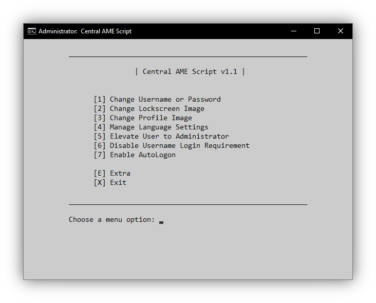

# Central AME Script (amecs)

Script for automating a large assortment of AME related actions.

## Usage

You can download the script by going to the [latest release](https://git.ameliorated.info/Styris/amecs/releases/latest) and selecting `amecs.exe` from the **Downloads** section. Once downloaded, simply run `amecs.cmd`.

## Summary

As part of the amelioration process, certain UI elements, such as the **Region and language** page in Windows Settings, have been removed, and require alternative ways to execute the tasks. This script fills in those gaps, and allows for automating a large variety of customization tasks.

If you prefer manually executing commands for some of these tasks without a script, you can go through the step-by-step guides on [AME Guides](https://t.me/AMEGuides).

## Primary Functions

There are many actions in AME that require commands or are otherwise unavailable. The following functions work as replacements for those actions.

#### Username/Password

This function allows for changing the user's username or password.

The following command can also be used for changing a username:

    wmic useraccount where "name='<User's Username>'" rename '<New Username>'

Similarly, the following command can be for changing the password:

    net user "<User's Username>" "<New Password>"

#### Lockscreen Image

This function allows for changing the lockscreen image.

It works by taking ownership of the existing profile image files, and replacing them with the new image supplied by the user.

#### Profile Image

This function allows for changing the user's profile image (PFP).

It does this by taking ownership of the existing profile image files, and replacing them with the new image supplied by the user. Several necessary registry changes are made as well.

#### User Elevation

This function allows for elevating or de-elevating the user to or from administrator. Elevating the user disables the password requirement when trying to run an executable as administrator. However, this has large security implications, thus why it is not the default setting.

The following command can also be used for this purpose:

    net localgroup administrators "<User's Username>" /add

Or the following for de-elevating the user:

    net localgroup administrators "<User's Username>" /delete

#### Keyboard Language

These functions allow for adding or removing a keyboard language.

At its core, this is done by using the following command:

    PowerShell -NoP -C "$NewLangs=Get-WinUserLanguageList; $NewLangs[0].InputMethodTips.Add('<Language/region ID>:<Keyboard Identifier>'); Set-WinUserLanguageList $NewLangs -Force"

If the user chose to make their selection the new default input method, the following command will also be run:

    PowerShell -NoP -C "Set-WinDefaultInputMethodOverride -InputTip "<Language/region ID>:<Keyboard Identifier>""

The Language/region ID and Keyboard identifier for a given language can be found [here](https://docs.microsoft.com/en-us/windows-hardware/manufacture/desktop/available-language-packs-for-windows?view=windows-11#language-packs) and [here](https://docs.microsoft.com/en-us/windows-hardware/manufacture/desktop/windows-language-pack-default-values?view=windows-11) respectively.

To remove a keyboard language, it fetches the existing language list, filters out the selected language, and sets the modified language list.

#### Username Login Requirement

This function allows for disabling or enabling the username login requirement.

The following command can also be used for this purpose:

    reg delete "HKLM\SOFTWARE\Microsoft\Windows\CurrentVersion\Policies\System" /v dontdisplaylastusername /f

Or the following for enabling the requirement:

    reg add "HKLM\SOFTWARE\Microsoft\Windows\CurrentVersion\Policies\System" /v dontdisplaylastusername /t REG_DWORD /d 1 /f

#### AutoLogon

This function allows for enabling or disabling the automatic login of the current user.

It uses modified code from [rzander's AutoLogon program](https://github.com/rzander/AutoLogon), which can also be used for enabling AutoLogon.

#### .NET 3.5

This function allows for enabling or disabling .NET 3.5, requiring a Windows ISO or boot drive for installation.

## Extra Functions

This section contains beta, legacy, or less used functions. Legacy functions are only useful for versions of AME predating the [REDACTED].

#### Windows Subsystem for Linux (WSL)

These functions are currently unavailable.

#### Hibernation

This function allows for enabling or disabling the hibernation option in Windows.

At its core, the following commands are used:

    powercfg /HIBERNATE /TYPE FULL

Or the following for disabling hibernation:

    powercfg /HIBERNATE OFF

#### Notification Center

This function allows for enabling or disabling the Notification Center in the bottom right of the taskbar.

The following command can also be used for this purpose:

    reg add "HKU\<User's SID>\Software\Policies\Microsoft\Windows\Explorer" /v DisableNotificationCenter /t REG_DWORD /d 0 /f

Or the following for disabling the Notification Center:

    reg add "HKU\<User's SID>\Software\Policies\Microsoft\Windows\Explorer" /v DisableNotificationCenter /t REG_DWORD /d 1 /f

#### Desktop Notifications

This function allows for enabling or disabling desktop toast notifications.

The following command can also be used for this purpose:

    reg add "HKU\<User's SID>\SOFTWARE\Microsoft\Windows\CurrentVersion\PushNotifications" /v ToastEnabled /t REG_DWORD /d 1 /f

Or the following for disabling desktop notifications:

    reg add "HKU\<User's SID>\SOFTWARE\Microsoft\Windows\CurrentVersion\PushNotifications" /v ToastEnabled /t REG_DWORD /d 0 /f

#### Windows Script Host (Legacy)

This function allows for enabling or disabling Windows Script Host (WSH). WSH is necessary for some programs.

The following command can also be used for this purpose:

    reg add "HKU\<User's SID>\SOFTWARE\Microsoft\Windows Script Host\Settings" /v Enabled /t REG_DWORD /d 1 /f
    reg add "HKLM\SOFTWARE\Microsoft\Windows Script Host\Settings" /v Enabled /t REG_DWORD /d 1 /f

Or the following for disabling WSH:

    reg add "HKU\<User's SID>\SOFTWARE\Microsoft\Windows Script Host\Settings" /v Enabled /t REG_DWORD /d 0 /f
    reg add "HKLM\SOFTWARE\Microsoft\Windows Script Host\Settings" /v Enabled /t REG_DWORD /d 0 /f

#### Visual Basic Script (Legacy)

This function allows for enabling or disabling Visual Basic Script (VBS). VBS is necessary for some programs.

The following command can also be used for this purpose:

    assoc .vbs=VBSFile

Or the following for disabling VBS:

    assoc .vbs=

#### NCSI Active Probing (Legacy)

This function allows for enabling or disabling NCSI Active Probing. Some applications require this to be enabled.

The following command can also be used for this purpose:

    reg add "HKLM\SYSTEM\CurrentControlSet\Services\NlaSvc\Parameters\Internet" /v EnableActiveProbing /t REG_DWORD /d 1 /f

Or the following for disabling NCSI Active Probing:

    reg add "HKLM\SYSTEM\CurrentControlSet\Services\NlaSvc\Parameters\Internet" /v EnableActiveProbing /t REG_DWORD /d 0 /f

#### NVIDIA Control Panel

This function allows for installing or uninstalling NVIDIA Control Panel. This is useful since NVIDIA Control Panel no longer properly installs during a driver installation* due to it using an APPX deployment (Not supported in AME).

Firstly, it fetches the store link from this git repository (`links.txt`), and fetches the download link from [store.rg-adguard.net](https://store.rg-adguard.net/). Afterwards, it downloads NVIDIA Control Panel from said link\*. Once NVIDIA Control Panel is downloaded, the script extracts and places it in `<System Drive>\Program Files\NVIDIA Control Panel`, and subsequently creates a start menu shortcut for it.

For removal, it simply removes the `<System Drive>\Program Files\NVIDIA Control Panel` directory, as well as the start menu shortcut.

Note: Even though NVIDIA Control Panel installation fails during a driver installation, it still creates the necessary NVIDIA Control Panel files in `<System Drive>\Program Files\WindowsApps`. If this is the case, the script will attempt to use those files instead of downloading them.

\*Standard drivers do not have this issue, however, those have been discontinued by NVIDIA.

## Known Issues

Some keyboard languages may not work, and a few may be improperly tagged.